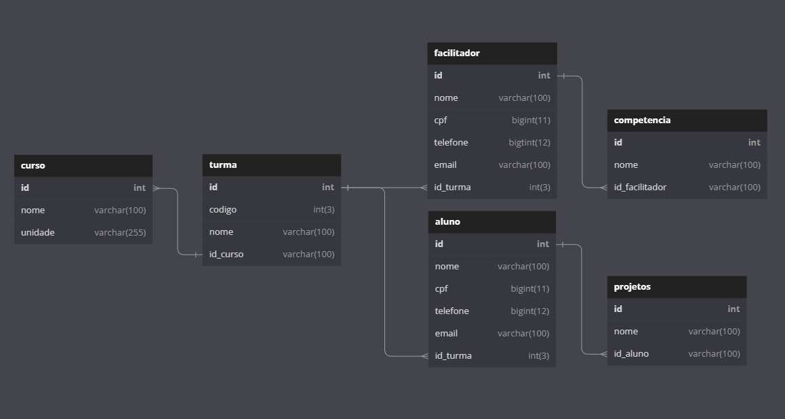

<h1 align="center"><a href="https://www.mysql.com/products/workbench/"> 🔗 MYSQL Workbench </a></h1>

Banco de dados para acompanhamento de cursos, turmas e alunos da Resilia Educação.

# Tabela de conteúdos

<!--ts-->

- [Contexto](#contexto)
- [Diagrama do Banco de Dados](#diagrama-do-banco-de-dados)
- [Perguntas](#perguntas)
- [Tecnologias](#tecnologias)
<!--te-->

# Contexto

 A Resilia está pensando em lançar um novo sistema de
acompanhamento e para isso precisa de ajuda para modelar um
banco de dados que vai armazenar seus cursos, turmas e alunos.

# Diagrama do Banco de Dados

# Perguntas

 
⇨ Existem outras entidades além dessas três?  
      - Sim, foram adicionadas as entidades "Facilitador", "Competência" e "Projetos".  
   
⇨ Quais são os principais campos e tipos?  
      - Os principais campos são nome, cpf, telefone e email.  
   
⇨ Como essas entidades estão relacionadas?  
      - Elas estão relacionadas pelo ID.

# Tecnologias

<a href="https://www.mysql.com/products/workbench/"> 🔗 MYSQL Workbench </a>

<a href="https://dbdiagram.io/"> 🔗 DBDiagram </a>

